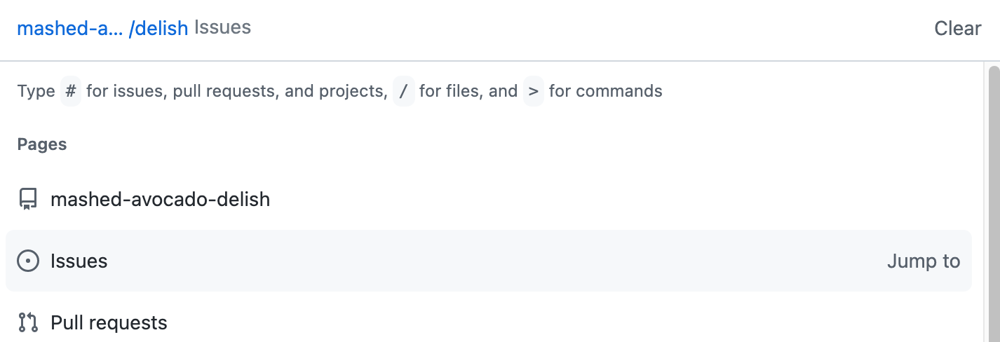

---
# try also 'default' to start simple
#theme: seriph
theme: seriph
# random image from a curated Unsplash collection by Anthony
# like them? see https://unsplash.com/collections/94734566/slidev
background: https://source.unsplash.com/collection/94734566/1920x1080
# apply any windi css classes to the current slide
class: 'text-center'
# https://sli.dev/custom/highlighters.html
highlighter: shiki
# show line numbers in code blocks
lineNumbers: false
# some information about the slides, markdown enabled
info: |
  ## Slidev Starter Template
  Presentation slides for developers.

  Learn more at [Sli.dev](https://sli.dev)
# persist drawings in exports and build
drawings:
  persist: false
---

# Github 
## features you propably don't know

Kamil Kulig

---
layout: two-cols
---

# agenda

<v-clicks>

* about me
* github definition
* good deal, microsoft
* markdown power, readme
* issues, discussions
* command palette
* actions + pages = blog
* command line
* codeowners
* jira + github, smart commits
* universe 2022

</v-clicks>

---
layout: two-cols
---

# about me

<v-clicks>

* team leader 
* fullstack developer 👨‍💻
* python & typescript lover 🐍
* eternal optimist 😎
* romantic programmer 🌹
* sport freak ⚽️🏀🏈🥊

</v-clicks>

::right::

---
layout: two-cols
---

# git

 Popular, free and open source distributed version control system (VCS) designed to handle everything from small to very large projects with speed and efficiency.

::right::

# github

Free service hosting for software development and version control using Git.

---
layout: two-cols
---

# microsoft, good deal

<v-clicks>

 
In 2018 Microsoft acquired GitHub, for $7.5 billion in stock. 

The deal, which heightened Microsoft's focus on open-source development, aimed to increase enterprise use of GitHub and bring Microsoft's developer tools and services to new audiences.

gitlab now worth twice wha microsoft paid for github

https://www.cnbc.com/2021/10/17/gitlab-now-worth-twice-what-microsoft-paid-for-github.html

what about us developers?

</v-clicks>

::right:: 

<v-clicks>

WHY I WAS SO WORRIED?

</v-clicks>
---
layout: center
---

# markdown power

1. [Code](#code)
2. [Task lists](#task-lists)
3. [Hide details](#hide-details)
4. [Badges](#badges)
5. [Jokes](#jokes)
   
---
layout: two-cols
---
# issues, discussions, wiki

<v-clicks>
 
Track ideas, discussions, documentation, feedback, tasks, or bugs for work on GitHub.

All project staff in one place

Reason why I love github. 

I hate Jira. https://ifuckinghatejira.com/

https://github.com/features/issues

</v-clicks>

::right::

<v-clicks>

Easy to create:

Command line

Website

Command pallete
 
Mobile 😢

</v-clicks>

---
layout: two-cols
---

# command line
## github cli

<v-clicks>

* issues track
* pull requests
* releases
* repository
* gh actions & workflows

</v-clicks>

::right::

<v-clicks>

https://cli.github.com/

https://cli.github.com/manual/gh

</v-clicks>
---
layout: two-cols
---

# command palette

It is a user interface (UI) element that gives users quick access to many commands. 
It's usually a free-form input field that helps users find an action by narrowing down a list, based on what they type.

<v-clicks>

Fast navigation
  
Easy access to commands

https://github.blog/changelog/2021-10-27-command-palette-beta/

</v-clicks>

::right::
<v-clicks>

</v-clicks>

---
layout: two-cols
---

# actions + pages = blog

## Github Actions

GitHub Actions is a continuous integration and continuous delivery (CI/CD) platform that allows you to automate your build, test, and deployment pipeline.

<v-clicks>

* Run a workflow on any GitHub event
* Linux, macOS, Windows, ARM, and containers
* Any language
* Easy to use 
* Readable

</v-clicks>

::right::

<v-clicks>

https://github.com/features/actions

</v-clicks>

---
layout: two-cols
---

# actions + pages = blog
## Github Pages

<v-clicks>

GitHub Pages is a static site hosting service that takes HTML, CSS, and JavaScript files straight from a repository on GitHub, optionally runs the files through a build process, and publishes a website.

</v-clicks>

::right::

https://pages.github.com/

---
layout: center
---

# actions + pages = blog

<v-clicks>

https://chadbaldwin.net/2021/03/14/how-to-build-a-sql-blog.html

https://kuligkamil.github.io/

</v-clicks>

---
layout: center
---
# code owners

## automaticly add person to code review

https://docs.github.com/en/repositories/managing-your-repositorys-settings-and-features/customizing-your-repository/about-code-owners#example-of-a-codeowners-file

---
layout: center
---

# jira + github, smart commits

https://docs.github.com/en/get-started/writing-on-github/working-with-advanced-formatting/using-keywords-in-issues-and-pull-requests

https://support.atlassian.com/jira-software-cloud/docs/process-issues-with-smart-commits/

---
layout: center
---

# github universe 2022

https://www.youtube.com/watch?v=AYRxDoUxcfQ&t=2s&ab_channel=GitHub

Copilot = Your AI pair programmer. 

Voice control XD 
<!-- awesome I don't need colleages -->